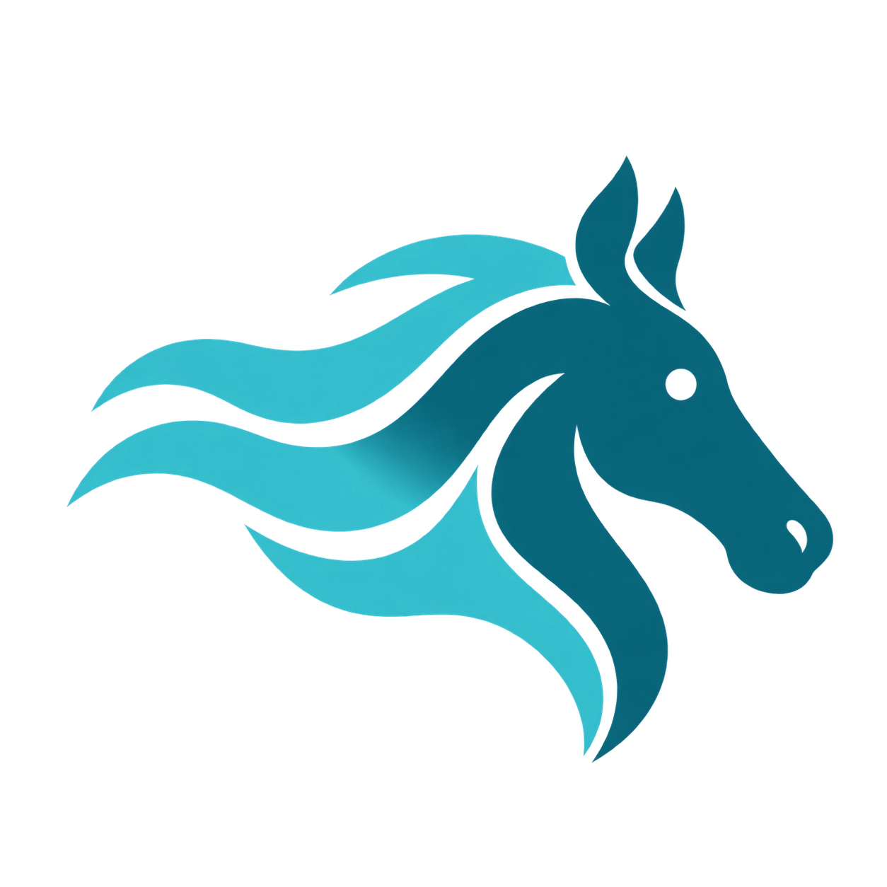

<h4 align="right">
  简体中文 | <a href="README.md">English</a>
</h4>

<p align="center"></p>

<h1 align="center">Kelpie</h1>

<p align="center">和电驴一样快的 eD2k 下载引擎，五行代码快速接入。</p>

> [!NOTE]
> Kelpie 正在开发中，尚未发布 v0.1.0。

## 为什么选择 Kelpie

- **和电驴一样快。** 电驴下载快不快，取决于能找到多少来源、能不能在别人的队列里排上号。这些能力 Kelpie 都按电驴的做法实现了：
  - 用安全身份认证积攒积分，上传得越多，在别人的队列里排得越靠前；
  - 排队期间定期回询，不丢掉排队位置；
  - 能连上处于内网的低 ID 用户；
  - 和其他用户互相交换来源；
  - 同时向所有服务器搜索来源。

  完整的能力清单见 [ADR-0003](docs/adr/0003-own-engine-core.md)。
- **守规矩，不被封。** 只连一台服务器，请求频率遵守电驴的规定，用自己的名字标识客户端，下载时也给别人上传。这样换来的是积分，而不是封禁。
- **支持 IPv6。** 两台都使用 Kelpie 的电脑之间可以直接通过 IPv6 交换数据，内网用户也有机会互相连上。

## 怎么使用

Kelpie 由两部分组成：
- **引擎程序**：从 [Releases](https://github.com/XiaoYouChR/Kelpie/releases) 下载对应系统的版本。
- **Python 包**：把仓库里的 `kelpie/` 文件夹复制到你的项目中即可，只依赖标准库，需要 Python 3.11 及以上。

```python
from kelpie import Error, Kelpie, Link, Settings

kelpie = Kelpie(lambda: enginePath, dataFolder, lambda: Settings())
link = Link.parse("ed2k://|file|example.bin|2048|31D6CFE0D16AE931B73C59D7E0C089C0|/")

try:
    async with kelpie.runDownload(link, downloads / link.name) as run:
        async for progress in run:
            print(f"{progress.received}/{progress.size}，速度 {progress.downloadRate} B/s")
except Error as error:
    print(error.code, error.message)
```

每个 `async with` 代码块就是一次下载或做种。代码块打开时文件开始传输，离开代码块传输就停止。引擎程序由 Kelpie 按需启动，你不用管理它。出错时，代码块抛出 `kelpie.Error`。

各个概念的定义见 [CONTEXT.md](CONTEXT.md)（英文），设计理由见 [ADR-0004](docs/adr/0004-transfers-run-only-while-observed.md)。

## 架构

```
应用程序 ─▶ kelpie Python 包 ══ 标准输入输出 ══▶ 引擎进程
                                                 ├─ 下载核心：文件传输、上传队列、服务器连接
                                                 └─ Kad 模块：节点维护、来源检索
```

Kelpie 由 Python 包与引擎进程两部分组成，二者通过标准输入输出交换逐行 JSON 消息，协议定义见 [docs/protocol.md](docs/protocol.md)。

引擎进程采用 Actor 模型：仅下载核心与 Kad 模块持有状态；网络读写、磁盘读写等其余组件不持有状态，只以消息形式向二者提交结果。该结构从设计上排除了并发修改共享状态的可能，详见 [ADR-0005](docs/adr/0005-two-hub-actors.md)。

```
Kelpie/
├── kelpie/            Python 接口
├── cmd/kelpie/        引擎进程入口
└── internal/
    ├── gateway/       标准输入输出与下载核心之间的消息转换
    ├── engine/        下载核心
    ├── kad/           Kad 模块
    ├── peer/          对端会话状态机
    ├── transfer/      文件传输状态机
    ├── upload/        上传队列状态机
    ├── server/        服务器会话状态机
    ├── wire/          协议编解码
    ├── piece/         分块与校验
    ├── link/          链接解析
    ├── identity/      安全身份认证
    ├── transport/     网络接口，含测试用模拟实现
    ├── disk/          磁盘接口，含测试用模拟实现
    ├── clock/         时钟接口，含测试用模拟实现
    └── store/         持久化状态，兼容读取 goed2k 数据
```

## 参与开发

```sh
go build -o build/kelpie ./cmd/kelpie
go test -race ./...
python -m pytest tests
```

需要连接真实电驴网络的测试，只有设置了 `KELPIE_NETWORK=1` 才会运行。代码约定见 [CLAUDE.md](CLAUDE.md)。

## 名字的由来

eDonkey 是驴，eMule 是骡子，到了 Kelpie，就轮到马了。Kelpie 是苏格兰传说中会变形的水马，在水中来去自如，就像下载来源从四面八方汇聚而来。

## 相关项目

- [Ghost Downloader](https://github.com/XiaoYouChR/Ghost-Downloader-3)：一款全能下载器，Kelpie 最早就是为它开发的。

## 许可证

MIT。引擎的部分代码源自 [goed2k](https://github.com/monkeyWie/goed2k)，详见 [NOTICE](NOTICE)。
